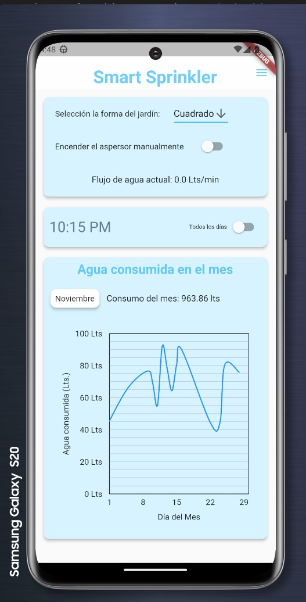

# SmartSprinkler
This project is developed as part of the Mechatronics Design course at Tec de Monterrey, aiming to meet and exceed the course's rigorous standards.

## Prerequisites
To effectively use, modify, or further develop this project, you'll need to set up your environment with the following tools and resources:

1. **Git**: Version control system essential for managing and tracking changes in the project. [Download Git](https://git-scm.com/downloads).
2. **GitHub**: Platform for hosting and collaborating on Git repositories. [Sign up or log in to GitHub](https://github.com/).
3. **Visual Studio Code (VS Code)**: A powerful and versatile code editor. [Download VS Code](https://code.visualstudio.com/Download).
4. **Arduino IDE**: Integrated development environment for Arduino programming. [Download Arduino IDE](https://www.arduino.cc/en/software).
5. **Arduino VS Code Extension**: Enhances Arduino programming capabilities in VS Code. Install from the VS Code Extensions marketplace.
6. **Arduino Libraries**: Essential libraries for Arduino development. They can be installed directly through the Arduino IDE.
7. **Flutter**: UI toolkit for building natively compiled applications. Note: Use Windows for Android development and MacOS for iOS development. [Download Flutter](https://flutter.dev/docs/get-started/install).
8. **CAD Software**: Essential for designing and visualizing mechanical components of the project. Use a CAD program like SolidWorks, or a similar tool that suits your design needs.

With these tools installed, you'll be equipped to work seamlessly on the SmartSprinkler project and bring your innovative ideas to life.

## Project Highlights

### Mobile App Interface
Get a glimpse of our user-friendly and intuitive mobile application, designed for both Android and iOS platforms.

  
  
  

### CAD Prototype
Check out the CAD prototype of our SmartSprinkler system, showcasing the intricate design and engineering behind our project.

With these tools installed and a sneak peek into our project's components, you'll be equipped to work seamlessly on the SmartSprinkler project and bring your innovative ideas to life.